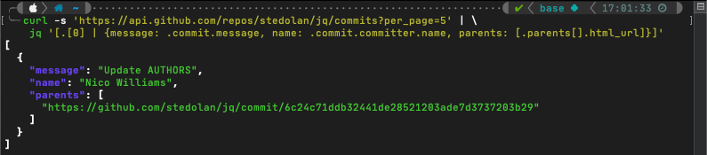

# 18 [Free] Tools and Technologies for the IT-Generalist

I work in IT, and I wear many hats. So very many hats. Every day presents different and unique challenges that require unique solutions. Some days I am DevOps, others I am a cloud architect. I might wake up tomorrow and put on my security hat to fortify the network, or I might dress up as the printer repair man. The point is, I never know -- but I love it that way. 

Because I spend so much of my time hopping from platform-to-platform, I'm always on the lookout for a handy new tool that makes my life a little easier. Back when I got started in IT, I remember quickly feeling overwhelmed at the sheer number of different tools people were using. But over time, you learn to appreciate the value in simple tools that do one thing really, REALLY well versus catch-all tools that barely scratch the surface. 

The list I've collected here is by no means comprehensive. Some are more simple than others, and don't even really all fit into a single category. In fact, the tools you choose to build into your personal toolkit are just that - personal. But my goal with this list is to provide a sampling of some of the tools that I use every single day. I had even completely forgotten about some of the tools I included below because they've just become so ingrained in my daily routine that I take for granted the fact that at some point in my life I had to stumble across them and then incorporate them into my workflow. 

## Core Components

### [# Homebrew](https://brew.sh/) 
_(package manager)_


We'll start with Homebrew, because a significant number of tools in this list can be procured with this tool. It's also worth pointing out that to fully maximize the benefit you gain from using a tool like Homebrew _(and, indeed, the rest of the tools in this list)_ you really do need to spend a few extra minutes learning about how it works and what changes it's going to make to your system on your behalf - things like, "Where is this tool going to install executable binaries?" 

Homebrew is a package manager for macOS with hundreds (thousands?) of different packages available to choose from. With five minutes worth of time investment on your part, you'll have a tool that makes it painlessly simple to search for and install tools or packages you use regularly in a matter of seconds. 

---

### [# Nerd Fonts](https://www.nerdfonts.com/)
_(system fonts)_


Not a "tool", but if you're going to spend any length of time staring at a terminal prompt, why not make your environment a little more pleasant _(and informative)_? Nerd Fonts is a collection of patched fonts that includes thousands of glyph icons that can be used in everything from word processors to terminals. Personally, I use them exclusively in my terminals and text editors. 

The icons come from a number of popular libraries: Font Awesome, Devicons, Octicons, and others. You'll see from some of the tools listed below that these fonts can be used to make your life on the terminal easier by providing information at-a-glance. 

My personal favorites are "`Caskaydia Cove Nerd Font`" for Windows-based terminals, and "`JetBrains Mono Nerd Font`" for just about everything else including macOS and Linux. 

Check out the [Nerd Fonts Cheat Sheet](https://www.nerdfonts.com/cheat-sheet) for a quick way to search through their library of glyphs to find exactly what you're looking for. 

---

### [# Powerlevel10k](https://github.com/romkatv/powerlevel10k)
_(terminal customization)_


There is an unending list of tools and resources you can use to "gussy-up" your terminal prompt, but my go-to is Powerlevel10k. Its simple, quick to deploy, responsive, and works incredibly well for me. You may be tempted to think you should use something like "oh-my-zsh" in conjunction with Powerlevel10k, but don't do it. Oh-my-zsh is unnecessary and could actually slows things down. 

Powerlevel10k offers a lot of built-in functionality, but if you've got some time to put into it, the configuration file generated by the startup wizard is well documented. Functionality can be extended quite easily once you familiarize yourself with it. 

This tool also plays very nicely with Nerd Fonts. In fact, I consider the two a quintessential power-couple. 

---

### [# Kitty Terminal](https://sw.kovidgoyal.net/kitty/)
_(terminal emulator)_


Even though this tool is cross-platform between macOS and Linux, I always tend to stick with the default terminal on macOS. That may just simply be out of laziness, though - because with every flavor of Linux I install, Kitty is one of the very first tools I load up. 

Kitty is a GPU-based terminal with some really nice features:
- GPU offloading (obviously),
- threaded,
- ligature and hyperlink support,
- configurable, extendable, programmable,
- grids, tabs, and loads of keyboard shortcuts
- mouse support (because its nice to have when you need it),
- and quite a bit more.

The documentation on the Kitty site is very detailed and you'll find information for any setting you want to tweak.

---

### [# Anaconda / Conda](https://www.anaconda.com/products/distribution)
_(python)_


If you spend much time working with Python, you're likely familiar with some of the common pain-points and already have some kind of solution for working with different environments. My go-to solution for this is Anaconda (Conda).

Conda makes it painless to switch between specialized Python environments with custom packages installed in each. What sets it apart is its independence from the version of Python already installed on your system. You can easily create a new environment and install any version of Python that you aren't already using. You can still use pip to install packages, but to get the most out of Conda's ability to report on everything installed in an environment, give `conda search` and `conda install` a try. `conda list` will still attempt to enumerate any packages you've installed with pip, though, and in general I've found it to be quite good at doing so. 

One quick word of advice -- definitely add the [conda-forge repository](https://conda-forge.org/) after installation. Anaconda will install the default repository out-of-the-box, but conda-forge is community supported and provides a huge number of popular packages. 

---

### [# Visual Studio Code](https://code.visualstudio.com/)
_(text editors / IDEs)_


Most of the technically minded people I know fall into one of two camps:
- those who hate electron-based apps
- those who are indifferent to them

If you're one of those for whom it doesn't matter, or if you're willing to overlook that fact as long as the performance is not negatively affected, I humbly submit to you my trusty editor of choice - Visual Studio Code. 

Having tried a varied assortment of editors and IDEs over the years, I come back to VSCode over and over again because of its simplicity and extensibility. I've heard from plenty of friends that complain about its performance when burdened with many add-on extensions, but as a frame of reference, I have 45 extensions running within VSCode at this moment and have yet to experience a single performance issue. 

Some time ago I put together my own "extension pack" purly for personal use. I'm frequently setting up and using new systems across different operating systems and I prefer to have a consistent set of tools between them. For that reason, my extension pack contains 35 extensions that I use frequently. You are welcome to [check it out in the VSCode Marketplace](https://marketplace.visualstudio.com/items?itemName=BryanDodd.bdpack) and use it yourself if these tools align with your own needs.


One quick note about that extension pack - because it only installs other existing extensions, if you install the pack, you are still able to selectively choose individual extensions and disable or remove them without removing the entire pack itself. 

---

### [# Lens for Kubernetes](https://k8slens.dev/desktop.html)
_(kubernetes tools)_


Even though roughly 95% of the work I do with Kubernetes is performed from the terminal, it's still nice to have a GUI option for surface observation, and "Lens" for Kubernetes fills that role quite nicely. I would not recommend this as a tool for managing production clusters, and it's not a "one tool to rule them all" solution. However, when you have several lower-environment clusters that you switch between frequently, this tool provides a convenient single pane of glass from which to view your cluster's operating surface. 

It reads from your local kube config file and offers point-and-click switching between contexts. I cannot speak to the product's "Lens Spaces" offering because I've never used that feature -- and when it comes to Kubernetes security, I probably won't. The emphasis for this particular tool is its helpfulness for lower environments, and I do find myself using it with some regularity. 

---

## Terminal Technology

I'm going to switch gears a little here and transition to some of the most helpful terminal-based resources that I use on a daily basis. 

### [# exa](https://github.com/ogham/exa)
_(terminal tools)_


Exa is a rust-based drop-in replacement for '`ls`' on macOS and Linux based systems. It provides colorized output, icon support, and is symlink, attribute, and git aware. This is one of those tools where, after you get it installed and set your aliases up to use it the way you want, you completely forget its there. It is truly a pleasure to use.

There are several display flags, long-view parameters, and filtering options you can pass into the tool on execution, but I primarily use it extensively via alias: 
``` bash
alias ll="exa -lahHg --icons --group-directories-first --time-style long-iso --git --octal-permissions"
```
```
Breakdown:
                     l      = display extended details and attributes
                     a      = show all files
                     h      = add a header row to each column
                     H      = list each file's number of hard links
                     g      = list each file's group
--icons                     = include file and folder icons in the output
--group-directories-first   = the name says it all
--time-style long-iso       = options include 'default', 'iso', 'long-iso', and 'full-iso'
--git                       = list each file's git status (including if tracked or ignored)
--octal-permissions         = list each file's permissions in octal format
```

There is quite a bit this handy tool can do, and the [documentation](https://the.exa.website/docs) is well-written. 

---

### [# bat](https://github.com/sharkdp/bat)
_(terminal tools)_


Bat is another rust-based drop-in replacement, this time for '`cat`' - and offers syntax highlighting, git integration, automatic paging, and more. When you work with files across several different technologies and find yourself needing to look at them frequently, the syntax highlighting and line-number support make life just a little nicer. 

While you can certainly alias '`bat`' as a full replacement for '`cat`', I'd recommend resisting the urge to do it, because there are occasions where you'll still want to utilize cat instead -- such as piping content or if using your mouse to copy/paste multiple lines of text out of a file (the line numbers get in the way of doing that easily).

---

### # Aliases & Functions
_(shell profile)_

Speaking of aliases, this is a good time to mention this often overlooked gem. It may sound riculous, but I've watched so many people completely disregard the benefits of configuring custom aliases and functions within your shell profile. A little time invested in carefully planning and designing these customizations can pay big dividends when you're in a time crunch and need to power through certain tasks quickly. 

The aliases or functions you find helpful are going to be very personal to you, but here is a brief sample of some examples from my own  profile:

```bash
# base64 string encoding
encode() { echo -n "$1" | base64; echo; }

# base64 string decoding
decode() { echo "$1" | base64 --decode; echo; }

# get information about an ip address
ipinfo() { if [ $# -eq 0 ]; then curl ipinfo.io; else curl ipinfo.io/$1; fi }

# check for listening ports
alias listen='lsof -nP -i4 | grep LISTEN'

# flushing your dns
alias flushdns="sudo killall -HUP mDNSResponder;sudo killall mDNSResponderHelper;sudo dscacheutil -flushcache"

# which user are you logged into aws using?
alias awsuser="export AWS_PAGER='' && aws sts get-caller-identity --output yaml && export AWS_PAGER='less'"

# expand a short url
expandurl() { curl -sIL $1 | grep ^Location; }
```

---

### [# diff-so-fancy](https://github.com/so-fancy/diff-so-fancy)
_(diff tools)_


Both this tool and the next (delta) can be used independently of one another. In fact I suspect that's now most people would use them. But I have my own odd preferences, and in this case I prefer to use `diff-so-fancy` for 'in-line' file diffs or comparisons of very short files.

Have you ever found yourself looking at a git-diff and thought to yourself, "This could really be a lot easier to read" ?  Enter 'diff-so-fancy'. It humanizes the output and provides some color-coding to make things really pop out. 

It can be plugged in to git as a default diff tool, or as I use it most often, with a custom function that pipes off of 'diff':
```bash
fdiff() { if [[ "$#" == "2" ]]; then diff -u $1 $2 | diff-so-fancy; else printf "\n Only two imputs supported."; fi }
```

---

### [# delta](https://github.com/dandavison/delta)
_(diff tools)_


When I'm comparing larger files, or files I have less familiarity with, I like to use '`delta`'. This is a feature-rich diff tool that, like 'diff-so-fancy', can be used with git or any number of other tools. 

There are quite a number of different ways this tool can be used, so I definitely suggest checking out the [documentation](https://dandavison.github.io/delta/introduction.html). But for my personal usage, I most often use it as follows:

```bash
fdiffside() {
    if [[ "$#" == "2" ]]; then
        delta --paging never --dark --side-by-side --line-numbers $1 $2
    else
        printf "\n Only two imputs supported."
    fi
}
```

---

### [# oathtool](https://www.nongnu.org/oath-toolkit/)
_(totp tokens)_

  

I have an unfortunately large number of MFA codes that I have to use on a daily basis. When you've only got a handful to keep track of, it's not the end of the world to have to pull your phone out to grab a new token. But when you're being prompted for one every 5 minutes it becomes a massive pain. The "OATH Toolkit" (sic) has been an incredible time-saver for me. 

When an application or service prompts you to scan a new MFA QR code, they most often include the token string itself or a link to view the token string. At this point, I've made a habit of always collecting that code and saving it someplace secure. And as it turns out, I now have a very good way to put those codes to work for me with OATH Toolkit. 

The manpage for the tool can be [found here](https://www.nongnu.org/oath-toolkit/man-oathtool.html), but using the tool is a breeze for common time-based one-time passcodes (TOTP):
```bash
oathtool -b --totp AA1BBB2CCCCDDEEE
```

To really make this tool effective for me, I gathered a list of all of my MFA codes and stored them in a tab-delimited file. Each line of the file contains a short, descriptive identifier for the token (i.e., o365, lastpass, aws, vpn, etc), a tab character, then the MFA string. With the magic of shell scripting, I can pass in a search string, search that file for the line containing the matching identifier, 'awk' out the MFA string, pass it to 'oathtool', and pipe the output over to 'pbcopy' so that all that's left for me to do is paste my decoded TOTP token into whichever application I need. 

You can take this to the next level with a macOS tool called "[xbar](https://github.com/matryer/xbar)". By refactoring my shell script to align with xbar's requirements, I now have a convenient macOS toolbar dropdown with click-to-copy functionality for all of my MFA tokens. 

If you're interested in using this module for yourself, I've made it freely available [on GitHub](https://github.com/bryandodd/xbar). The readme also [includes instructions](https://github.com/bryandodd/xbar#mfa-from-terminal) for how to implement MFA codes from the terminal. 


---

### [# ipcalc](https://jodies.de/ipcalc)
_(subnet calculator)_


Some people are gifted with the ability to calculate IP subnets and ranges in their head. I am not one of those individuals. When I need to do IP math (which as it turns out is more frequently than I'd like), I've found '`ipcalc`' to be a reliable companion tool. 

`ipcalc` takes an IP address and netmask, then calculates the resulting broadcast, network, wildcard mask, and host range.

Like all of the other terminal-based tools described here, `ipcalc` is available via Homebrew. 

---

### [# jq](https://stedolan.github.io/jq/)
_(json parsing)_



I work with a lot of JSON files. JSON, itself, is great and I like working with it because its easy to make sense of. It becomes a problem, though, when you're working with very large objects or they're compacted to a single line. 

'`jq`' is a command-line processor for JSON. Taken from the product page:
> jq is like sed for JSON data - you can use it to slice and filter and map and transform structured data with the same ease that sed, awk, grep, and friends let you play with text.

Full disclosure - outside of _simple_ tasks, I frequently come back to their documentation for help with some of the more advanced features. It has a bit of a learning curve, but once you understand the basic syntax it makes working with JSON output in the terminal significantly easier.

I use this tool most frequently when writing shell automation scripts for AWS. The AWS CLI allows you to specify JSON as an output format. Then with '`jq`', it becomes easier to parse out just the pieces of information relevant to your task, run any processing on it, and use that data in subsequent CLI commands. 


Two good places to get started with '`jq`' include [their own tutorial](https://stedolan.github.io/jq/tutorial/) and the [full documentation](https://stedolan.github.io/jq/manual/).

---

### [# kubectx](https://github.com/ahmetb/kubectx)
_(kubernetes tools)_


If you use Kubernetes (or even if you're just starting out), this is a very handy tool to have at your disposal.

'`kubectx`' is really two tools in one.
* '`kubectx`' is a tool for quickly switching between Kubernetes context (clusters). Run by itself with no input, it will output a list of all available contexts. Then to switch, run the command again and pass it the name of the context you want to use. 
* '`kubens`' is a tool for switching between Kubernetes namespaces within your current context. Similar to it's sibling, run `kubens` by itself to get a listing of all available namespaces on the current cluster, and run it again and pass in a namespace to switch to the specified namespace. 

Honestly, this really should have been built directly into the '`kubectl`' tool from the get-go. 

---

### [# watch](https://gitlab.com/procps-ng/procps)
_(terminal tools)_


'`watch`' is a handy tool that will execute a specified command periodically and show the output fullscreen. By default, it will attempt to run the command you pass to it every _two seconds_, but you change this by passing the '`-n`' parameter with the desired number of seconds between executions.  

There are a handful of other parameters you can pass:
```bash
Options:
  -b, --beep             beep if command has a non-zero exit
  -c, --color            interpret ANSI color and style sequences
  -d, --differences[=<permanent>]
                         highlight changes between updates
  -e, --errexit          exit if command has a non-zero exit
  -g, --chgexit          exit when output from command changes
  -n, --interval <secs>  seconds to wait between updates
  -p, --precise          attempt run command in precise intervals
  -t, --no-title         turn off header
  -w, --no-wrap          turn off line wrapping
  -x, --exec             pass command to exec instead of "sh -c"
```

For an example use case, I frequently use this with '`kubectl`' commands as I watch for changes within a cluster:
```bash
watch kubectl get pods
```

---

### [# age](https://github.com/FiloSottile/age)
_(file encryption)_


Finally, we come to security. Over the years, I've looked at and experimented with a number of file protection and encryption tools. Most recently, I've found `Age` to be an effective, simple, and even elegant solution.

The man page is [available here](https://filippo.io/age/age.1), and the format specification at https://age-encryption.org/v1.

The tool itself is made up of two binaries:
* `age` (for encryption/decryption), and
* `age-keygen` (generates new native age key pairs)

Native age keys are very small and compact, the security it offers is solid, files can be encrypted for one or more recipients, and the tool is flexible enough to be used synchronously or asynchronously. Files are encrypted as a binary file by default, but the tool has an ASCII 'armored' encoding mode for ASCII-only output. Just be aware that your encrypted filesizes will be larger in ASCII-only mode. 

You can encrypt files for specific recipients using only their public key, and the tool supports three key types:
- native age keys
- ssh-ed25519
- ssh-rsa

This means that encrypting a file for a specific GitHub user is as simple as:
``` bash
curl -s https://github.com/benjojo.keys | age -R - example.jpg > example.jpg.age
```

Decryption is simplified because the tool transparently detects if a file was encrypted with ASCII armoring, and automatically prompts for a passphrase if one was used during encryption. 

In short '`Age`' is an effective, secure, and easy way to protect sensitive files and I use it quite a bit for my own files.